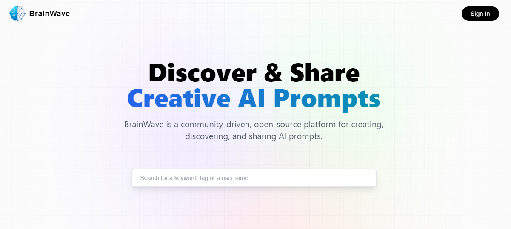

# **BrainWave - A Prompt Sharing Platform**
### Introduction
BrainWave is an open-source platform designed for AI enthusiasts, developers, and creators to discover, create, and share innovative prompts. Whether you're looking for inspiration or want to showcase your unique ideas, BrainWave connects the community through powerful AI-driven prompts for platforms like ChatGPT, Google Gemini, MidJourney, Bing Designer, and more.